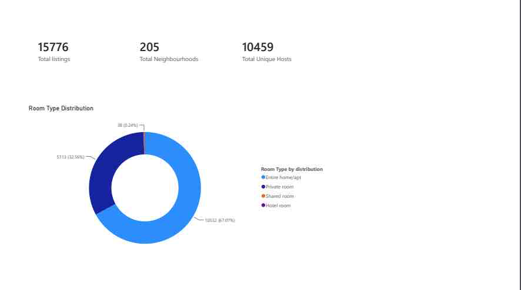
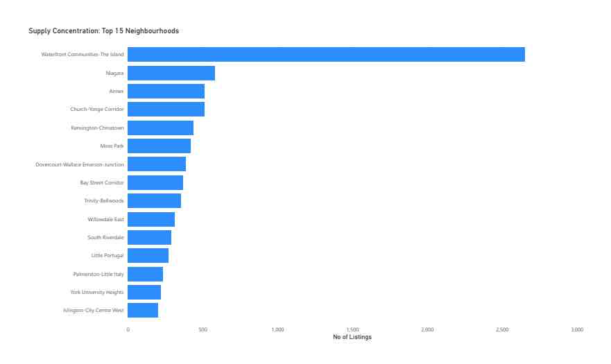
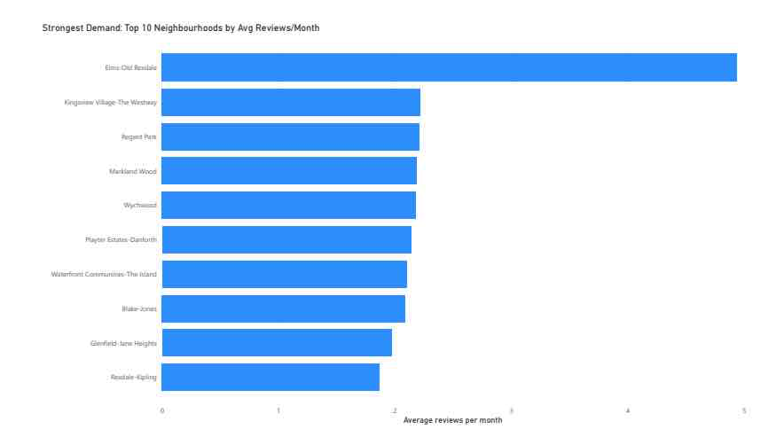
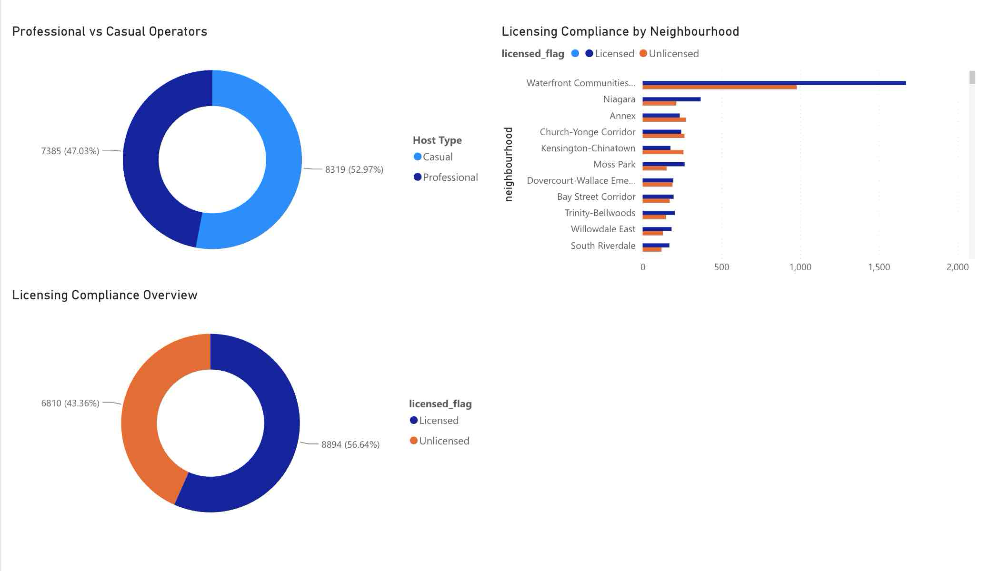

# 🏙️ Toronto Airbnb Market Analysis — Supply, Demand & Licensing

---

## 📌 Project Overview

A Toronto-based short-term rental startup is evaluating market entry. The CEO needs data-driven answers to four critical questions before committing capital: where to launch, what product to offer, how to compete, and what regulatory risks to manage.

This analysis of 15,776 active Toronto Airbnb listings across 140 neighbourhoods was built to answer exactly those questions — giving leadership a clear, evidence-based picture of where opportunity exists and where risk is highest.

---

## 🎯 Business Questions

1. **Where is supply concentrated?** Which neighbourhoods are saturated and which are underserved?
2. **Where is demand strongest?** Where are guests actually booking, not just browsing?
3. **Who is the competition?** How do professional operators compare to casual hosts?
4. **What is the licensing risk?** Where is regulatory exposure highest?

---

## 📊 Dashboard Screenshots

### Market Overview

### Supply Concentration — Top 15 Neighbourhoods

### Demand Analysis — Top 10 Neighbourhoods by Avg Reviews/Month

### Host Competition & Licensing Compliance

---

## 💡 Executive Insights

### 🏘️ Q1 — Where Should We Launch?

**Avoid Waterfront Communities for now.** With 2,659 listings — 16.9% of the entire Toronto market concentrated in a single neighbourhood — it is the most saturated area in the city. A new entrant launching here faces intense competition from established operators with hundreds of reviews and optimized pricing.

**Target Elms-Old Rexdale instead.** This neighbourhood has the highest average reviews per month in all of Toronto at 4.94 — nearly 2.5x the city average — yet it has relatively low listing count. High demand, low supply, and weak competition from established operators makes this the single best launch market for a new entrant.

**Other high-opportunity neighbourhoods:** Kingsview Village-The Westway (2.22 avg rpm), Regent Park (2.21 avg rpm), and Markland Wood (2.19 avg rpm) all show strong demand signals with manageable competition.

---

### 🛏️ Q2 — What Product Should We Offer?

**Entire home listings are the dominant product** — 67% of all Toronto Airbnb supply is entire home/apt. This is what guests want and what the market has validated.

**Private rooms represent a niche opportunity** at 32.6% of supply — lower revenue per booking but lower capital requirement to enter. For a startup watching burn rate, private room listings in high-demand neighbourhoods like Elms-Old Rexdale could generate positive cash flow faster.

**Avoid shared rooms and hotel rooms** — combined they represent less than 0.5% of the market. No meaningful opportunity exists there.

---

### 🏢 Q3 — Who Is the Competition and How Do We Win?

**47% of the Toronto market is controlled by professional multi-listing operators** — commercial entities running multiple properties simultaneously. At first glance this looks threatening. But the data tells a different story:

**Casual hosts significantly outperform professional operators on demand.** Casual hosts average **1.53 reviews/month** compared to just **0.84 for professional operators** — nearly double the booking velocity. This suggests guests prefer the authenticity, responsiveness, and personalized experience of individual hosts over commercial operators.

**This is the startup's competitive advantage.** By positioning as a guest-first, high-quality individual hosting brand rather than a commercial bulk operator, a new entrant can realistically outperform the professional operators who dominate by listing count but underperform on actual demand.

---

### ⚖️ Q4 — What Is the Licensing Risk?

**This is the most urgent operational issue the CEO needs to address before launch.**

**43.4% of Toronto Airbnb listings — 6,843 properties — are currently operating without a licence.** This is not a minor compliance gap; it is a market-wide regulatory risk that could trigger enforcement action across the industry at any time.

**The risk is not evenly distributed:**
- **York University Heights** — only 35.6% of listings are licensed. Highest risk area.
- **Kensington-Chinatown** — 40.6% compliance. High tourist traffic, high regulatory scrutiny.
- **Annex** — 46.2% compliance. Residential neighbourhood with active community pushback on short-term rentals.
- **Moss Park** — 63.8% compliance. Relatively safer regulatory environment.

**Recommendation:** Launch fully licensed from day one. The 43.4% of unlicensed operators are running an existential risk — a single bylaw enforcement crackdown could eliminate nearly half the market overnight. A startup that launches compliant can survive and gain market share when competitors are forced offline.

---

## 🛠️ Tools & Technologies

| Tool | Purpose |
|------|---------|
| **BigQuery (Google Cloud)** | SQL analysis on cloud-hosted dataset |
| **Python (Pandas)** | Data cleaning, enrichment, and Power BI prep |
| **Power BI** | Interactive dashboard and visualization |
| **Inside Airbnb** | Source dataset |

---

## 📂 Data Source

- **Dataset:** Toronto Airbnb Listings — Inside Airbnb
- **Records:** 15,776 listings
- **Neighbourhoods:** 140
- **Unique Hosts:** 10,441
- **Features:** Neighbourhood, Room Type, Minimum Nights, Reviews, Host Listings Count, License Status

---

## 🧹 SQL Queries (BigQuery)

See full queries in [`toronto_airbnb_queries.sql`](toronto_airbnb_queries.sql)

---

## 🗂️ Repository Structure
Toronto-Airbnb-Market-Analysis/

├── README.md

├── toronto_airbnb_queries.sql

├── toronto_airbnb_final.csv

└── screenshots/

├── 01_market_overview.png

├── 02_supply_concentration.png

├── 03_demand_analysis.png

└── 04_host_licensing.png

---

##  Future Enhancements

- Add pricing analysis once price data is populated
- Time-series analysis of review trends by quarter
- Predictive model for licensing compliance risk scoring
- Comparison with Vancouver and Montreal Airbnb markets

---

## 👤 About Me

**Ven Anusuri** | Financial Advisor → Data Analyst

- 3+ years experience as a Financial Advisor at **TD Bank**
- Certifications: CSC, FP-1, CFSA, BCO, Google Data Analytics, Bloomberg Market Concepts, IBM Python
- Building a 10-project data analytics portfolio bridging finance domain expertise with data skills

🔗 [Project 1 — Canadian Big 5 Banks Stock Dashboard](https://github.com/Ven-Anusuri/canadian-banks-stock-dashboard)
🔗 [Project 2 — Customer Financial Profile Analysis](https://github.com/Ven-Anusuri/customer-financial-profile-analysis)
🔗 [project 3 - Loan Approval Analytics intrest Rate Impact](https://github.com/Ven-Anusuri/Loan-Approval-Analytics-Interest-Rate-Impact)

